# Probability and Statistics for Engineering and the Sciences
#### Jay Devore - Eighth Edition

## Chapter One - Overview and Descriptive Statistics

- Statistics is how we make judgements in the presence of uncertainty and variation.
- A **census** is all desired information for every object in the **population**.
   - Since census' are typically infeasible, a **sample** is required.
  
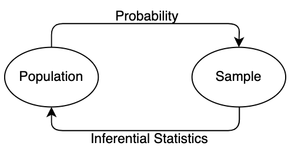

- We can *deduce* from population to sample with probability, and *infer* from sample to population with statistics.
- A major issue with collecting data is that the sample may not be reflective of the population.

### Types of samples:
1. *simple random sample*: every object has the same chance of being selected.
2. *stratified sample*: objects are split into nonoverlapping groups and each group is sampled.
3. *convenience sample*: sampling without systematic randomization.

- Types of descriptive displays: stem-and-leaf, dotplots, histograms, boxplots.
  - For boxplots, the left box boundary is the lower fourth (median of smaller half of data) and the right boundary is the upper fourth. The midline is the median of the whole dataset and the "whiskers" stretch to the lowest and highest data points.
- Distributions can be (a) unimodal, bimodal, multimodal and (b) symmetrical, positively skewed, negatively skewed.
- Think of the sample **mean** as the balance point fulcrum, where each object is a weight on a horizontal scale: 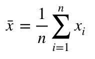
- The sample **median** (denoted by \tilde x) is insensitive to outliers, while the mean is sensitive to outliers.
  - a middle ground between mean and median is the **trimmed mean**, where a percentage of data points are trimmed from either end of the range.
  - if a dataset is negatively skewed, the mean will be less than the median and vice versa.
  
- variance and standard deviation are measures of variability that involve deviations from the mean.
  - the sum of deviations from the mean equals zero.
- **sample variance**: 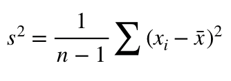
  - note that we divide by n - 1 rather than n because we tend to underestimate in samples (proof not included). Divide by n for populations.
- **standard deviation**: 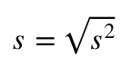
  - think of this as the typical deviation from the sample mean that you can expect from each data point.

## Chapter Two - Overview and Descriptive Statistics

- **sample space**: the set of all possible outcomes of an experiment, denoted by S.
- **event**: any subset in a sample space. Called *simple* if it consists of exactly one outcome and *compound* otherwise.
  - ex. Consider rolling a dice three times. The sample space is {111,112,113...} and the event that at least one roll is a two is {112,122,222,212..}
- **permutation**: an ordered subset
- **combinations**: an unordered subset
  
### Some definitions from set theory:
- the **complement** of A, denoted by A', is the set of all outcomes in S that are not in A. 
- the **union** of two events, denoted by 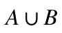, means all outcomes in A *or* B.
- the **intersection** of two events, denoted by 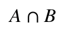, means all outcomes in A *and* B.
- the **null event** is the event that contains no outcomes.
  - when the intersection of two events is the null event, they are **mutually exclusive** or **disjoint**.

### Some basic properites of probability: 
- 0 <= P(A) <= 1
- P(S) = 1
- If A1, A2, A3... is a collection of disjoint events, then 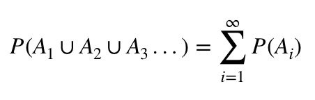
- P(A) + P(A') = 1
- For two events: 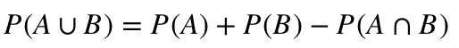
  - Similarly for three events: 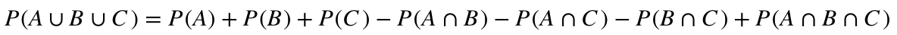

### Determining probability: 
- Interpreting probability: the ratio of occurences of event A to trials performed is called the **relative frequency** and is defined by n(A)/n.
  - As n gets arbitrarily large, the relative frequency becomes the limiting or **long-run relative frequency**, which is the interpretation of probability.
  - This doesn't mean that if the probability of an event is 10%, that 1/10 trials will cause that event, since 10 is not a long run number.
- For N **equally likely outcomes**, the probability of each outcome is 1/N
- For **ordered pairs of outcomes**, where the first event can be selected in n ways and the second event can be selected in m ways, the number of pairs possible is n*m. Still valid if events are dependent.
  - this product rule generalizes for k-tuples.
- the number of permuatations possible is given by: 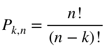, where n is the total number of outcomes and k is the number of outcomes being chosen.
- the number of combinations possible is given by: 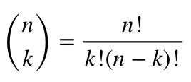
  - note that n choose n is 1 and n choose 0 is 0.

### Conditional probability: 
- the conditional probability of A given that event B has definitely occured is given by P(A|B).
  - the **prior** probability of A is P(A)
  - the **posterior** probability of A is P(A|B). Once we've gained knowledge of B, P(A) changes.
- 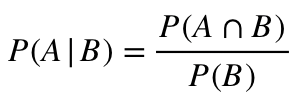
- **exhaustive** means if at least one A_i must occur.
- **law of total probability**: If events A1, A2... are mutually exclusive and exhaustive, then for some B: 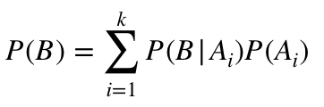
  - a great example for this is a deck of cards. Let B be a red card and let each A_i be the card values (1,2..jack, queen...). Then P(B = red cards) = P(B|jack)P(jack) + P(B|1)P(1) + ... = 13*[(2/4)*(4/52)]
- **Bayes' Theorem**: 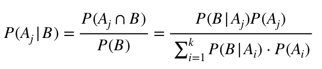

### Idependence:
- two events are independent if P(A|B) = P(A)
- two events are independent if and only if 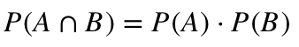
  - events A1, A2, ... are **mutually independent** for every subset if 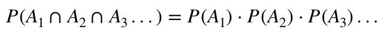
- if two events are mutually exclusive, they can't be independent

## Chapter Three - Discrete Random Variables and Probability Distributions
